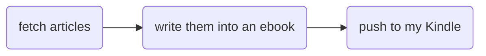

About four years ago, I used *Gouerduo Daily Report* for subscriptions to daily news for a period of time after I bought Kindle. I canceled it because of its uselessness. I found my isolation three months ago. However, about three months ago, I found my isolation and want to get more information about outside world.

I searched and compared with some productions for news subscription. I finally choose *Kindle4rss* and ordered it for one year.

I'm so careless to find that a lot of articles are uncomplete until nearly one month later. Some of them contain only first one of the multiple pages in the article of webiste. I mistook it for the invalid news from *CanKaoXiaoXi* for there is no hint of that. I also sent a email to *Kindle4rss* but there is no result. As a programmer, I decided to make it by myself.

**Principle:** Simple, easy to develope. It should be completed within a week during my lunch break.

The thread is simple:



I find some tools according to above, :


### Fetching of Articles

I plan to fetch articles from the *World News* column only in the first version.

### Fetch

After parsing some pages of the column of *cankaoxiaoxi.com*, I found that the multipage is powered by `AJAX`. The site send an asynchronous request to get a `json` file, in whitch `json.data` is what we want.

```python
start_urls = ['http://app.cankaoxiaoxi.com/?app=shlist&controller=milzuixin&action=world&page=1&pagesize=20']
```

I want to deal with it simpily. So just extract all links of the list.

```python
body = response.body[1:-1]
body = json.loads(body)
data = body["data"]
links = Selector(text=data).xpath("//a/@href").extract()
```

What I realy want is the news that is published most recently. Old ones are not needed. Just fetch the first page, and filter with their published date.

```python
date = datetime.datetime.strftime(datetime.datetime.now(), "%Y%m%d")

for link in links:
    if date not in link:
        return
    yield scrapy.Request(link, self.parse_article, dont_filter=False)
```

Get the links and put them in the fetching links stack. Then parse them by the  method `parse_article`. There is a challenge here which caused the problems in subscriptions of *Kindle4rss*. Some articles have more than one page. I also need to fetch the rest of the pages. Some of the these pages belong to *Extra Readings* which are not useful for me and need to be cutted.

```python
def parse_article(self, response):
        item = KindleItem()
        item['resource'] = "参考消息国际版"

        # parse the content
        item['title'] = response.xpath("//h1[contains(@class, 'YH')]/text()").extract_first()
        item['content'] = response.xpath('//div[contains(@class, "article-content")]').extract_first()
        item['url'] = response.url

        # drop the extra readings
        if '延伸阅读' in item['content'] :
            return

        # get the next page
        next_link = response.xpath("//p[contains(@class, 'fz-16')]/strong/a/@href").extract_first()

        if( next_link ):
            yield scrapy.Request(next_link, self.parse_article, dont_filter=False)

        # put them into the pipelines
        yield item
```

### Pipeline

The items extracted will be put into pipelines for further processing. What we usually do is storing them with database. However, we can just write them into `markdown` pages here for making an ebook according to the specification of the *Gitbok*. *What we get here is with markup of `HTML`, which can be parsed correctly in a `markdown` file.*

```python
class KindlePipeline(object):
    def process_item(self, item, spider):
        date = datetime.datetime.strftime(datetime.datetime.now(), "%Y%m%d")

        d = sys.path[0] + "/posts/" + date + "/"

        # Extract the filename from the url and cut the underline with integers in format '_1'. That will be the criteria of whether two pages belongs to one article.
        result = re.findall(r'(?<=\/)(\d+)(_\d+)?(?=.shtml)', item["url"])
        filename = result[0][0]

        # If there isn't any underline with integers, create a new file and write the contents into the file. The title and filename also need to be written into the file SUMMARY.md.
        if ( not result[0][1] or result[0][1] == "" ):
            f = open(d + filename + '.md', 'w')
            f.write('# ' + item["title"] + '\n\n')
            f.write(item["content"])
            f.close()
            summary = open(d + 'SUMMARY.md', 'a+')
            summary.write('* [' + item['title'] + '](' + filename + '.md)\n')
            summary.close()

        # Or just find the file with the extracted filename and append the contents.
        else:
            f = open(d + filename + '.md', 'a+')
            f.write(item["content"])
            f.close()
return
```
## Make an ebook

That can be done with one line of command with the power of *Gitbook*.

```sh
$ gitbook mobi ./ book.mobi
```

## Push to Kindle

Send an email with the attachment by `mutt` and `msmtp` to *Kindle*.

Then I need to integrate all those scripts with a `shell` file. The `shell` file will be excuted every day with `crontab`.

```sh
#!/bin/bash

ls_date=`date +%Y%m%d`

cd posts
mkdir ${ls_date}
cd ${ls_date}
gitbook init

echo "{\"title\": \"kindle推送-${ls_date}\"}" >> book.json

cd ../..
/usr/local/bin/scrapy crawl ckxx

cd posts
cd ${ls_date}
gitbook mobi ./ ./../../ebooks/${ls_date}.mobi

cd ../..
echo "kindle推送-${ls_date}" | mutt -s "kindle推送-${ls_date}" icily0719@kindle.cn -a "ebooks/${ls_date}.mobi"
```

## Problem

There is no exceptional handling here for I'm too lazy to do that!


**Complete code and files can be found here:** [kindlepush](https://github.com/erlzhang/kindlepush)
