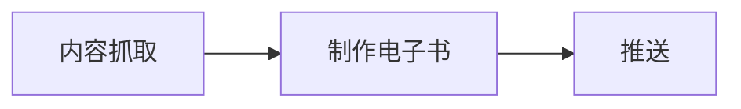
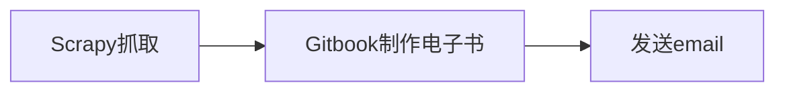

kindle刚买来没多久的时候，用过狗耳朵日报做每日电子报推送。后来觉得没什么用途，便弃之不用了。前一阵子忽然觉得我的生活过于与世隔绝了，于是便想再启用kindle的电子报推送功能。对比了一下决定用kindle4rss，买了一年的付费版。

<!--more-->

也是我自己的粗心大意，将近一个月我才发现，订阅的参考消息很多内容不全。对比一下网页版的，只有第一页的内容，而且文章里没有任何提示。导致我一度以为参考消息质量验证严重下降，文不对题。与客服交涉无果之后，我决定，作为一个有手有脚的程序员，还是自己动手吧！

**原则：** 简单，开发快捷，利用一个星期工作日的午休时间搞定。

思路也很简单：



对比着已知常用、不需要学习成本的工具，那就是：



## 内容抓取

第一版，只抓参考消息国际频道。

### 抓取

分析一下页面，翻页是js效果实现的，请求的 `json` 数据里，`data` 是列表的html。

```python
# 初始地址
start_urls = ['http://app.cankaoxiaoxi.com/?app=shlist&controller=milzuixin&action=world&page=1&pagesize=20']
```

简单处理，拿到列表中每个链接。

```python
body = response.body[1:-1]
body = json.loads(body)
data = body["data"]
links = Selector(text=data).xpath("//a/@href").extract()
```

新闻要的就是时效性，所以只拿最新数据即可。简单做，就不去翻页，只拿列表里的第一页（多了我也看不完），并做时间判断。

```python
date = datetime.datetime.strftime(datetime.datetime.now(), "%Y%m%d")

for link in links:
    if date not in link:
        return
    yield scrapy.Request(link, self.parse_article, dont_filter=False)
```

拿到链接后扔到队列，用`parse_article`解析。这里有个问题就是我在kindle4rss里遇到的问题，参考消息许多文章里面有分页，需要抓取分页的内容。部分分页是属于"延伸阅读"中的内容，不需要，排除。

```python
def parse_article(self, response):
        item = KindleItem()
        item['resource'] = "参考消息国际版"

        # 内容解析
        item['title'] = response.xpath("//h1[contains(@class, 'YH')]/text()").extract_first()
        item['content'] = response.xpath('//div[contains(@class, "article-content")]').extract_first()
        item['url'] = response.url

        # 排除延伸阅读
        if '延伸阅读' in item['content'] :
            return

        # 获取下一页内容
        next_link = response.xpath("//p[contains(@class, 'fz-16')]/strong/a/@href").extract_first()

        if( next_link ):
            yield scrapy.Request(next_link, self.parse_article, dont_filter=False)

        # 进入管道处理
        yield item
```
### 管道处理

Scrapy抓取到的内容都扔进管道，在`pipeline`中处理。通常抓取都是用数据库存储，这里为了配合后面制作电子书，按gitbook规定的格式，创建md文件即可[^1]。

```python
class KindlePipeline(object):
    def process_item(self, item, spider):
        date = datetime.datetime.strftime(datetime.datetime.now(), "%Y%m%d")

        d = sys.path[0] + "/posts/" + date + "/"

        # 提取文章url中文件名不带后缀不带分页（_1）的部分作为文件名，同时作为是否是同一篇文章的判断。
        result = re.findall(r'(?<=\/)(\d+)(_\d+)?(?=.shtml)', item["url"])
        filename = result[0][0]
        # 如果不带分页后缀，创建文件，写入标题内容，同时写入SUMMARY文件。
        if ( not result[0][1] or result[0][1] == "" ):
            f = open(d + filename + '.md', 'w')
            f.write('# ' + item["title"] + '\n\n')
            f.write(item["content"])
            f.close()
            summary = open(d + 'SUMMARY.md', 'a+')
            summary.write('* [' + item['title'] + '](' + filename + '.md)\n')
            summary.close()
        # 否则在原有文件后面追加内容
        else:
            f = open(d + filename + '.md', 'a+')
            f.write(item["content"])
            f.close()
return
```

## 制作电子书

gitbook一行命令搞定：

```sh
$ gitbook mobi ./ book.mobi
```

## 推送

`mutt` 加 `msmtp` 代理邮箱向kindle发送邮件。

整体用 `shell` 脚本串联起来，用 `crontab` 每天定时执行。

```sh
#!/bin/bash

ls_date=`date +%Y%m%d`

cd posts
mkdir ${ls_date}
cd ${ls_date}
gitbook init

echo "{\"title\": \"kindle推送-${ls_date}\"}" >> book.json

cd ../..
/usr/local/bin/scrapy crawl ckxx

cd posts
cd ${ls_date}
gitbook mobi ./ ./../../ebooks/${ls_date}.mobi

cd ../..
echo "kindle推送-${ls_date}" | mutt -s "kindle推送-${ls_date}" icily0719@kindle.cn -a "ebooks/${ls_date}.mobi"
```

## 问题

没有异常处理机制——懒得做！

**完整代码：** [kindlepush](https://github.com/erlzhang/kindlepush)

[^1]: md文件里带有html标签，markdown是可以正常解析的。
